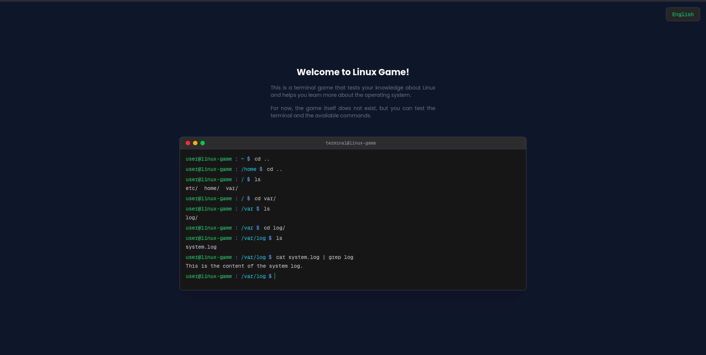

# Linux Game 🐧

An interactive Linux terminal game built with Next.js and React. This project aims to create an educational and fun experience to learn Linux commands through a simulated terminal.



## 📋 About the Project

**Linux Game** is a project under active development that simulates a complete Linux terminal environment. Users can practice common Linux commands such as `ls`, `cd`, `cat`, `grep`, among others, in a safe and interactive environment.

### Project Status

⚠️ **This project is under active development** ⚠️

The project is not yet complete, but you can already test the terminal and try out the available commands. Your help is very welcome!

## 🌐 Live Demo

Try the game online: **[https://linux-game-production.up.railway.app/](https://linux-game-production.up.railway.app/)**

> **Note**: Project links are centralized in [`config.json`](./config.json). Update that file to change links across the project.

## 🚀 How to Run

### Prerequisites

- Node.js 18+
- npm or yarn

### Installation

1. Clone the repository:
```bash
git clone <repository-url>
cd linux-game
```

2. Install dependencies:
```bash
npm install
```

3. Run the development server:
```bash
npm run dev
```

4. Open [http://localhost:3000](http://localhost:3000) in your browser

## 🌍 Translation

The project has full support for multiple languages. Currently available in:

- 🇺🇸 English
- 🇧🇷 Portuguese (Brazil)

### Contributing with Translations

Contributions with new translations are very welcome! To add a new language:

1. Create a `{language-code}.json` file in `app/locales/` (e.g., `es.json` for Spanish)
2. Copy the structure from an existing file and translate all values (`en.json` are the default language to copy)
3. Add the new language in `app/locales/index.ts`

The system will automatically detect the new language and it will appear in the language selector!

## 👥 Authors

See [AUTHORS.md](./authors.md) for a list of contributors to this project.

## 🤝 Contributing

Contributions are very welcome! This project is under active development and your help is valuable.

### How to Contribute

1. **Test the Terminal**: Try out the available commands and report bugs or suggestions
2. **Send Feedback**: Open an issue describing problems found or improvement ideas
3. **Translations**: Help translate the project to other languages
4. **Code**: Contribute with code following the project's best practices

### Areas That Need Help

- 🐛 Report bugs and issues
- 💡 Suggest new commands and features
- 🌍 Translations for new languages
- 📝 Documentation improvements
- 🎨 User interface improvements

## 📝 License

This project is licensed under the **GNU General Public License v3.0 (GPL-3.0)**.

```
Copyright (C) 2024 Linux Game Contributors

This program is free software: you can redistribute it and/or modify
it under the terms of the GNU General Public License as published by
the Free Software Foundation, either version 3 of the License, or
(at your option) any later version.

This program is distributed in the hope that it will be useful,
but WITHOUT ANY WARRANTY; without even the implied warranty of
MERCHANTABILITY or FITNESS FOR A PARTICULAR PURPOSE.  See the
GNU General Public License for more details.

You should have received a copy of the GNU General Public License
along with this program.  If not, see <https://www.gnu.org/licenses/>.
```

## 🛠️ Technologies Used

- **Next.js 16** - React framework
- **React 19** - JavaScript library
- **TypeScript** - Static typing
- **Tailwind CSS** - Styling
- **JSON** - Simulated file system

## 📞 Contact and Support

Found a bug? Have a suggestion? Want to contribute?

- Open an [Issue](https://github.com/pablolucas890/linux-game/issues) on GitHub
- Send a Pull Request with your improvements

---

**Note**: This project is under development. Features may change and bugs may occur. Your patience and contributions are greatly appreciated! 🙏
